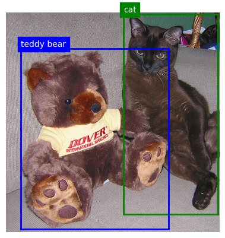

<div align="center">
<h1>Grounded Visual Spatial Reasoning</h1>

<a href='https://huggingface.co/datasets/tomhodemon/gounded-visual-spatial-reasoning'></a>


<br>
<br>
<br>

</div>

Code for generating [Grounded Visual Spatial Reasoning (GVSR) dataset](https://huggingface.co/datasets/tomhodemon/gounded-visual-spatial-reasoning). GVSR extends the [Visual Spatial Reasoning (VSR)](https://arxiv.org/pdf/2205.00363) dataset with **visual grounding annotations**: each caption is annotated with **COCO-category object mentions**, their **positions** , and corresponding **bounding boxes** in the image.

## Usage
```bash
python -m spacy download en_core_web_sm
```


```bash
python src/main.py \
    --split <split> \
    --coco_instances_train_file <"coco_train_instances_file> \
    --coco_instances_val_file <coco_val_instances_file>
```
## Download Images
To download the images, follow the instructions from the [VSR official GitHub repo](https://github.com/cambridgeltl/visual-spatial-reasoning/tree/master/data).

## Citation
If you use this dataset, please cite the original **Visual Spatial Reasoning** paper:
```bibtex
@article{Liu2022VisualSR,
  title={Visual Spatial Reasoning},
  author={Fangyu Liu and Guy Edward Toh Emerson and Nigel Collier},
  journal={Transactions of the Association for Computational Linguistics},
  year={2023},
}
```